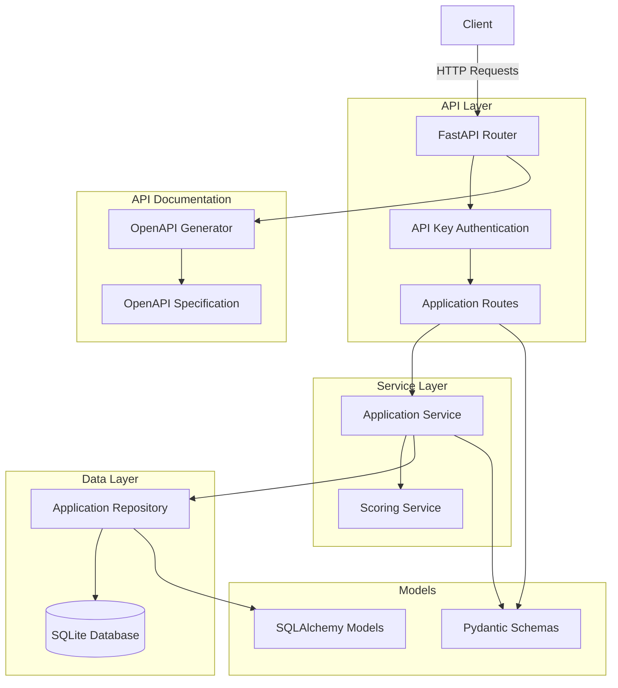

<!-- filepath: /Users/bf10162/devel/ms_hackathon/silly_walk/silly-walk-hack/docs/specifications/ARCHITECTURE.md -->
# ARCHITECTURE: The Silly Walk Grant Application Orchestrator

## Component Architecture Diagram

## Component Descriptions

### API Layer
- **FastAPI Router**: Main entry point for HTTP requests
- **API Key Authentication**: Middleware that validates API keys for sensitive endpoints
- **Application Routes**: Defines API endpoints for application submission and retrieval

### Service Layer
- **Application Service**: Contains business logic for application management
- **Scoring Service**: Implements the Silliness Scoring Algorithm

### Data Layer
- **Application Repository**: Provides data access methods for CRUD operations
- **SQLite Database**: Persistent storage for application data

### Models
- **Pydantic Schemas**: For request/response validation and serialization
- **SQLAlchemy Models**: ORM models for database interactions

### API Documentation
- **OpenAPI Generator**: FastAPI's built-in OpenAPI documentation generator
- **OpenAPI Specification**: Generated OpenAPI document describing all API endpoints

## Request Flow

1. Client sends a request to an API endpoint
2. Request is validated by the API Key Authentication middleware (for sensitive endpoints)
3. Request data is validated using Pydantic schemas
4. Application Service processes the request, calling the Scoring Service if needed
5. Application Repository handles data persistence operations
6. Response is generated and returned to the client

## Security Considerations

- API Key Authentication protects sensitive endpoints
- Input validation with Pydantic prevents malicious input
- SQLAlchemy ORM prevents SQL injection
- Secure error handling prevents leaking internal details
- HTTPS assumption for all API communications